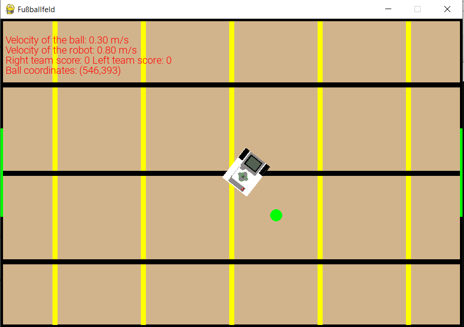
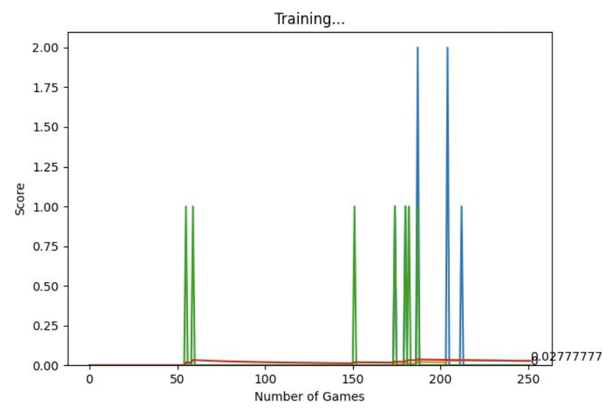
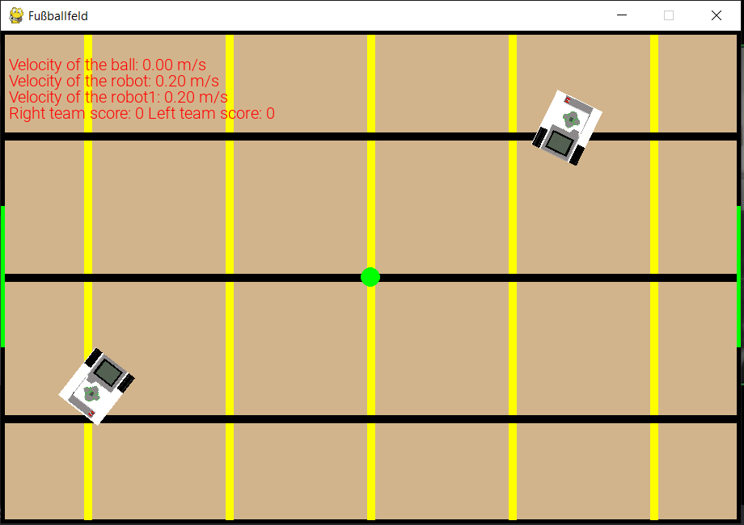

## Install anaconda on your Pc

https://www.anaconda.com/download

## Make a virtual environment and activate it by doing these steps :

`create --name myenv`
`conda activate myenv` 

## Now we need to install dependencies

`pip install -r Requirements.txt`

## Install Pytorch

`conda install pytorch torchvision cpuonly -c pytorch`

To run the simulation and command the robot with your keyboard, run <strong><code>game_fussball_roboter_human.py</code></strong>
 To run the simulation and train the robot, run <strong><code>agent.py</code></strong>

 To run the 1v1 game and train the robot, go inside the <strong><code>1v1</code></strong> directory and run <strong><code>agent.py</code></strong>

